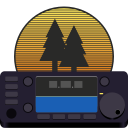

<p align="center">
  
</p>
<h1 align="center">Artemis</h1>
<h3 align="center">A Parks on the Air Spotting Tool®</h3>
<p align="center">
  <br />
    <a href="./LICENSE"></a>
    <a href="https://github.com/jaybaird/artemis-vala/actions/workflows/build.yml"></a>
    <a href='https://stopthemingmy.app'></a>
</p>

**Artemis** is a desktop application designed for amateur radio operators participating in **Parks On The Air (POTA)**. It helps hunters track QSOs, log parks, fetch and add spots, and control their radio to aid hunting. Built with **Vala**, **GTK4**, **Libadwaita**, **Shumate**, and **SQLite**.

Artemis is designed to be cross-platform, lightweight, and easy to use.

## Features

- **Hunt Parks**
  - Filter by band, mode, and program. Configure a "hit list," to be notified when a park, state, or callsign is spotted.
  - Track which parks have been hunted or activated.

- **Spot Management**
  - Fetch and display POTA spots in real-time.
  - Show latest QSOs per park.
  - Track spotter and activator comments.

- **Radio Integration**
  - Supports serial, USB, and network-connected radios via Hamlib.

- **Import/Export**
  - Import your already hunted parks from (POTA.app)[https://pota.app]
  - Ability to exporting hunter QSOs to QRZ; LoTW, UDP, or local ADIF log coming soon.

- **UI**
  - Modern GTK4/Adwaita interface.

## Installation

### Linux (Flatpak recommended)
```bash
flatpak install flathub com.k0vcz.Artemis
flatpak run com.k0vcz.Artemis
```

## Usage

1. Configure your callsign, location, and radio settings via Preferences.
2. Import your hunter.csv from POTA.app
3. View live POTA spots, filter by band, mode, and program. Track the spot to hold its position, tune your radio, rotate your beam, and add your spot!
4. Track which parks you’ve hunted, filter parks, and get notified for calls, parks, or states/countries of interest.
5. Use distance and bearing calculations for more efficient hunting.

**Contributions are welcome! Please submit pull requests or open issues for feature requests and bug reports.**

## Build from Source and Contributing

**Dependencies**
- Vala
- GTK 4
- Libadwaita
- GLib
- Gio
- Gee
- Hamlib
- JSON-GLib
- Dex
- WebKitGtk
- SQLite3
- Shumate

**Build using Meson**
```bash
git clone https://github.com/jaybaird/artemis-vala.git
cd artemis-vala
meson setup build
meson compile -C build
meson install -C build
```

## License

Artemis is licensed under GPL-3.0-or-later. See LICENSE for details.
