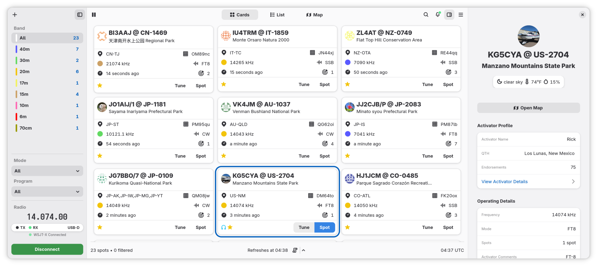
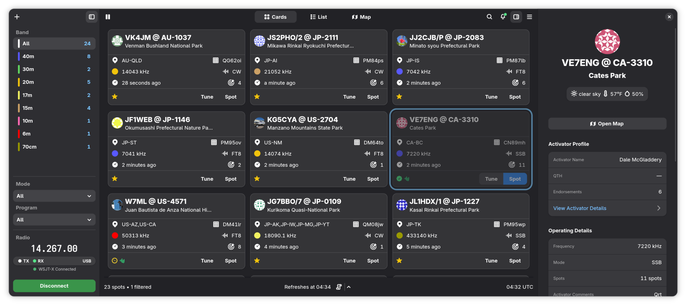
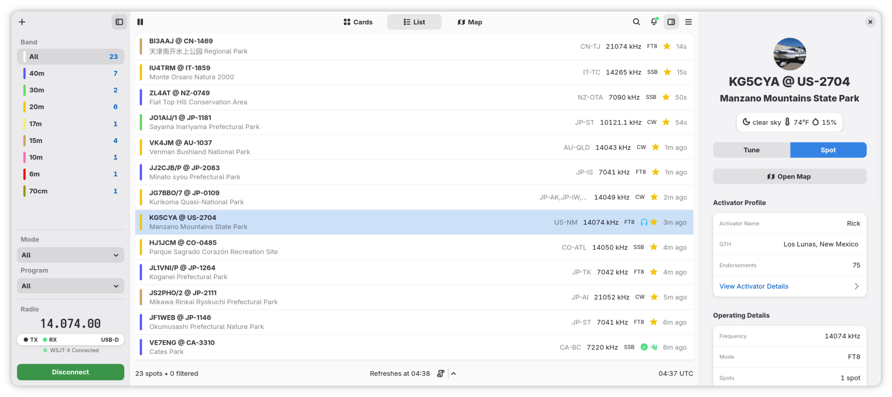
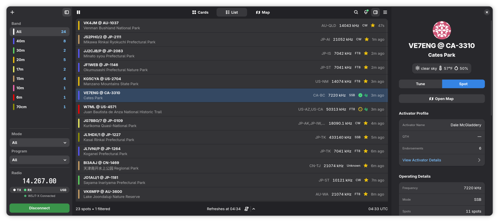
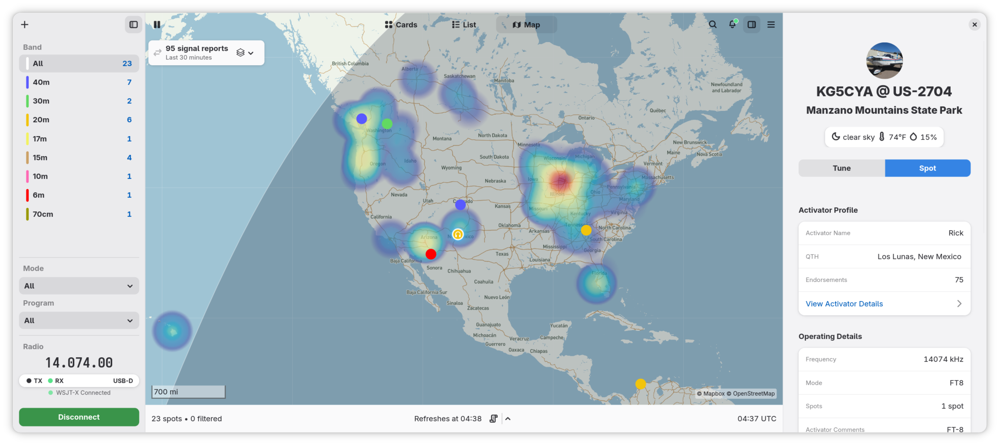
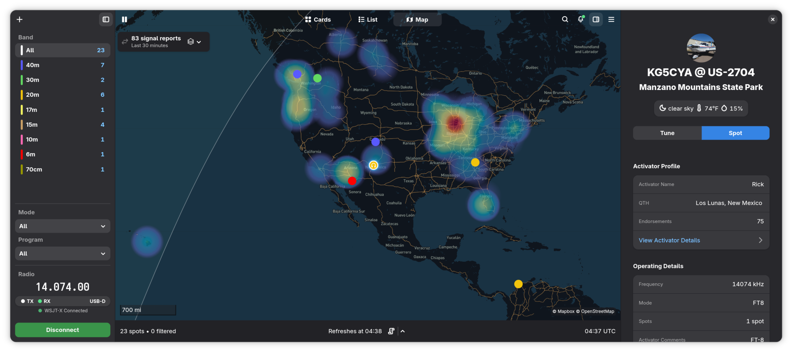

<p align="center">
  
</p>
<h1 align="center">Artemis</h1>
<h3 align="center">A Parks on the Air® Spotting Tool</h3>
<p align="center">
  <br />
    <a href="./LICENSE"></a>
    <a href='https://stopthemingmy.app'></a>
</p>

**Artemis** is a desktop application designed for amateur radio operators participating in **Parks On The Air (POTA)**. It helps hunters track hunted parks, fetch and add spots, and control their radio to aid hunting. Built with **Vala**, **GTK4**, **Libadwaita**, **Shumate**, and **SQLite**.

Artemis is designed to be cross-platform, lightweight, and easy to use.

## Screenshots


*Light theme cards view showing live POTA spots, sidebar filters, radio controls, and the spot detail inspector.*


*Dark theme cards view showing spot cards with band colors, activity badges, and quick tune and spot actions.*


*Light theme list view showing current spots in a compact table-style layout with frequency, mode, location, and activity details.*


*Dark theme list view showing filtered POTA spots with direct row actions for tuning and spotting.*


*Light theme map view showing park activity markers, signal report heatmap data, the sidebar filters, and the selected spot inspector.*


*Dark theme map view showing active parks and signal report heatmap data on an interactive map with the floating refresh status bar.*

## Features

- **Hunt Parks**
  - Filter by band, mode, and program. Configure a "hit list," to be notified when a park, state, or callsign is spotted.
  - Track which parks have been hunted or activated.

- **Spot Management**
  - Fetch and display POTA spots in real-time.
  - Track spotter and activator comments.

- **Radio Integration**
  - Supports serial, USB, and network-connected radios via Hamlib.

- **Import/Export**
  - Import your already hunted parks from [POTA.app](https://pota.app)
  - Upload completed POTA contacts to QRZ and write a local ADIF backup log when configured.

- **UI**
  - Modern GTK4/Adwaita interface.

## Installation

### Linux (Flatpak recommended)
```bash
flatpak install flathub com.k0vcz.Artemis
flatpak run com.k0vcz.Artemis
```

### Windows
Run `Artemis-Setup-<version>.msi`

## Usage

1. Configure your callsign, location, and radio settings via Preferences.
2. Import your hunter.csv from POTA.app
3. View live POTA spots, filter by band, mode, and program. Track the spot to hold its position, tune your radio, rotate your beam, and add your spot!
4. Track which parks you’ve hunted, filter parks, and get notified for calls, parks, or states/countries of interest.
5. Use distance and bearing calculations for more efficient hunting.

**Contributions are welcome! Please submit pull requests or open issues for feature requests and bug reports.**

## Build from Source and Contributing

**Dependencies**
- Vala
- GTK 4
- Libadwaita
- GLib
- Gio
- Gee
- Hamlib
- JSON-GLib
- Dex
- WebKitGtk
- SQLite3
- Shumate

**Build using Meson**
```bash
git clone https://github.com/jaybaird/artemis-vala.git
cd artemis-vala
meson setup build
meson compile -C build
meson install -C build
```

## Release Packaging

### Flatpak bundle
Requires `flatpak-builder` and the GNOME 50 runtime/sdk installed on your build host.

```bash
bash scripts/release-flatpak.sh
```

Artifact output:
- `dist/flatpak/com.k0vcz.Artemis.flatpak`

### Windows
Requires the Msys32 UCRT64 toolchain to be installed in your Windows environment with the above dependencies. To build the installer you will need to have the Wix v6 tool chain installed as well.

```bash
bash scripts/build-windows-bundle.sh
base scripts/build-windows-installer.sh
```

## License

Artemis is licensed under GPL-3.0-or-later. See LICENSE for details. Parks on the Air ® is a registered service mark of Parks on the Air, Inc.
